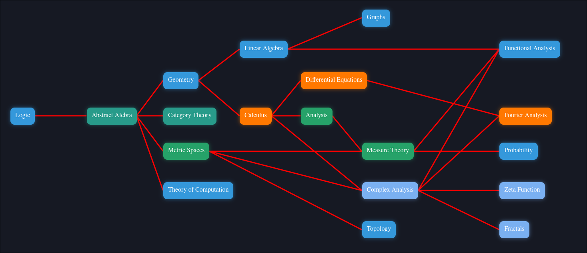
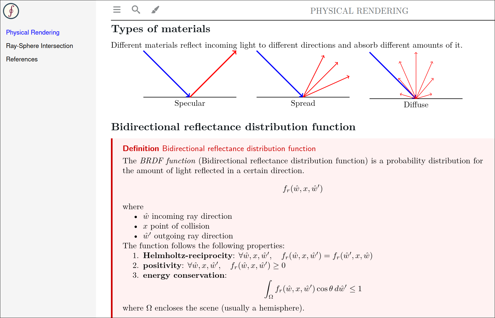

# Notes

Welcome to my notes! The following is a collection of math notes
and related subjects.
These notes are organized using the [stellar](https://github.com/paolobettelini/stellar)
software.

Check out the <b>[documentation](https://paolobettelini.github.io/stellar)</b>!

# Website preview




# Cite me
```bib
@online{paolobettelini,
  author    = {Paolo Bettelini},
  title     = {notes},
  year      = {2024},
  publisher = {GitHub},
  journal   = {GitHub repository}
}
```