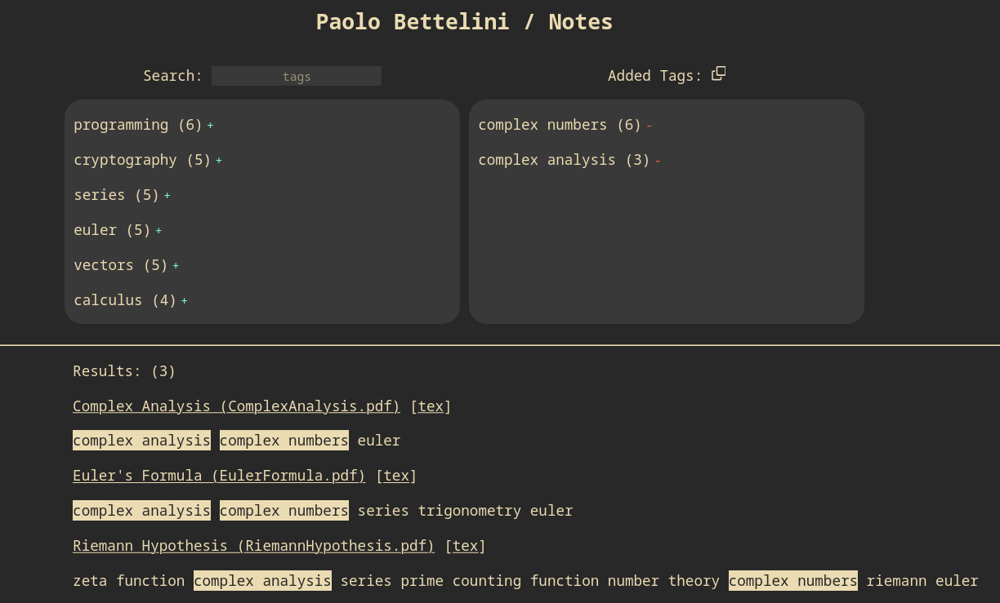
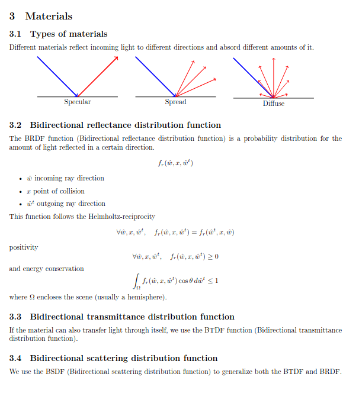
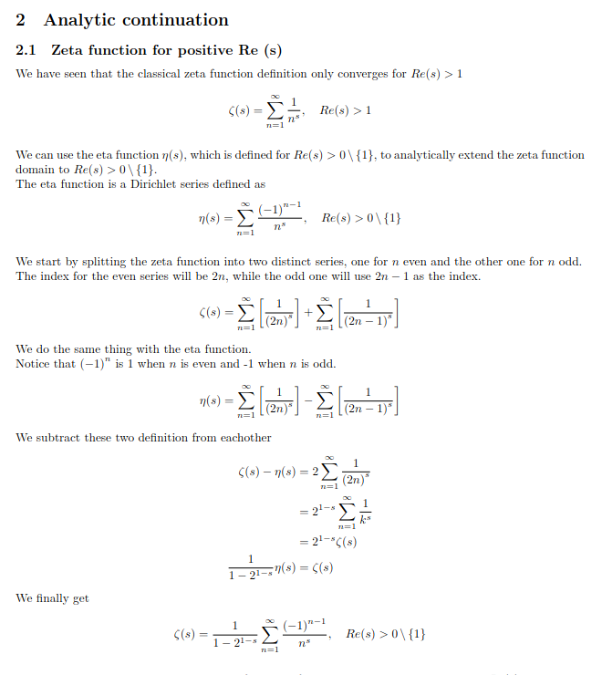
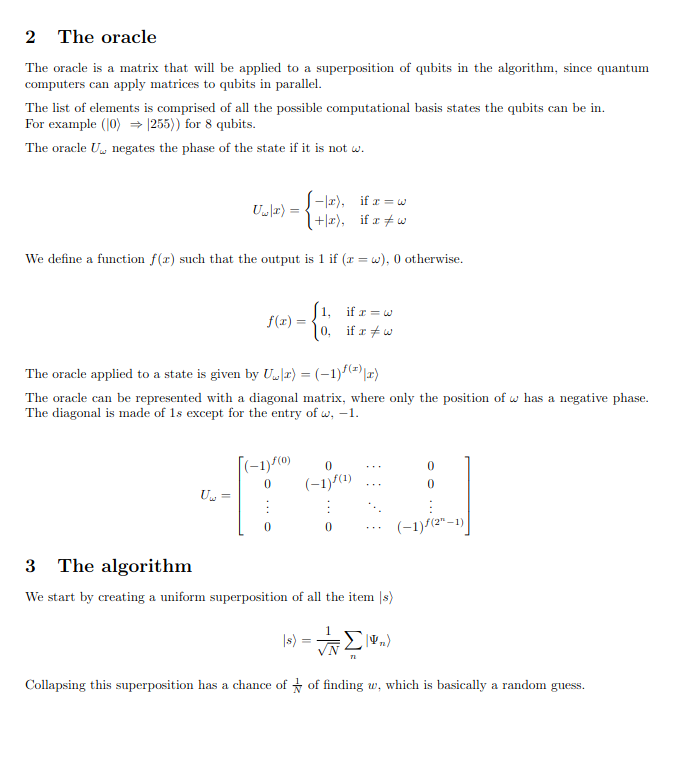
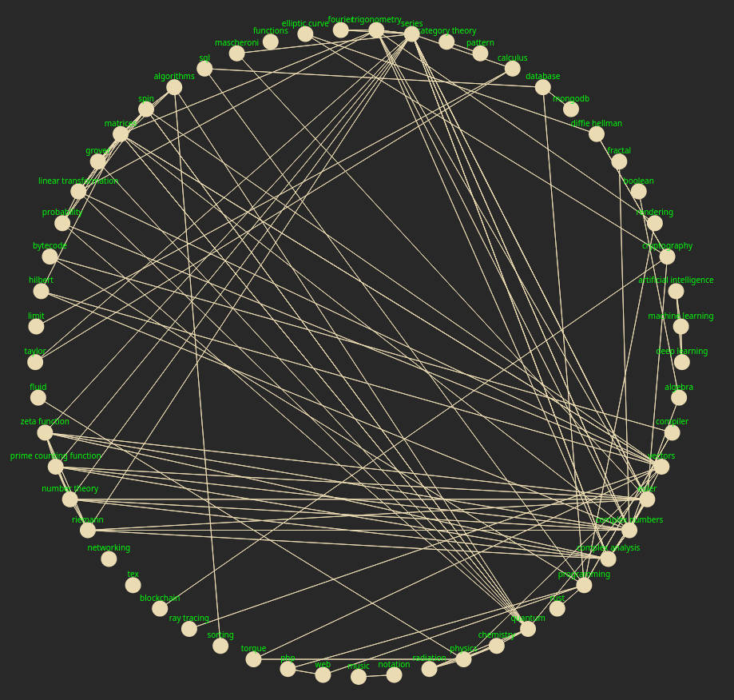

# notes
A collection of my personal notes.

All the PDF files have been compiled using Tectonic.

Search through my notes at [https://paolobettelini.github.io/notes](https://paolobettelini.github.io/notes).

> [!NOTE]
> Some of my notes are being moved to [stellar](./stellar) in a more course-like setting.
> PDF renders are not available so you need to host the website yourself for now.



<p float="center">
  
   
  
</p>

All my notes are organized using tags.
Here's a fun map to look at which shows every links between tags.




## Cite me
```bib
@online{paolobettelini,
  author    = {Paolo Bettelini},
  title     = {notes},
  year      = {2022},
  publisher = {GitHub},
  journal   = {GitHub repository},
  url       = {https://github.com/paolobettelini/notes}
}
```